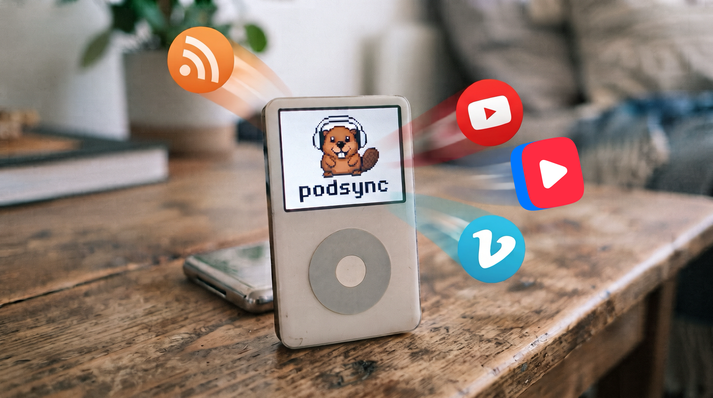

# Podsync (Fork)



Podsync - is a simple, free service that lets you listen to any YouTube / Vimeo / VK Video channels, playlists or user videos in
podcast format.

Podcast applications have a rich functionality for content delivery - automatic download of new episodes,
remembering last played position, sync between devices and offline listening. This functionality is not available
on YouTube, Vimeo and VK Video. So the aim of Podsync is to make your life easier and enable you to view/listen to content on
any device in podcast client.

## Fork Features

This fork extends the original `mxpv/podsync` with:
- **Web Admin Console (`/admin`)**: Built-in responsive web dashboard with authentication, ready-to-use podcast RSS links, 1-click clipboard copy, QR codes for instant smartphone subscribing, deep-links for Apple Podcasts / Pocket Casts / Overcast, feed management (add/delete channels, trigger updates, retry failed episodes), API key management, and system metrics (disk usage, memory, uptime, binary dependencies). See [Web Admin Guide](./docs/web_admin.md).
- **VK Video support**: Convert VK Video channels, communities, users, and playlists into podcast feeds (`vkvideo.ru`, `vk.com`, `vk.ru`).
- **yt-dlp integration**: Native preference and support for `yt-dlp` for improved download speed and stability.
- **Configurable `filename_template`**: Customize media filenames and RSS enclosure paths (e.g. `{{id}}`, `{{title}}`, `{{pub_date}}`).
- **One-time filename migration**: CLI tool (`--migrate-filenames`, `--migrate-filenames-dry-run`) to rename existing downloaded media to match a new template.
- **Extended environment variables**: `PODSYNC_VKVIDEO_API_KEY` (or `PODSYNC_VK_API_KEY`), `PODSYNC_ADMIN_ENABLED`, `PODSYNC_ADMIN_USERNAME`, `PODSYNC_ADMIN_PASSWORD`.

## Features

- Works with YouTube, Vimeo, VK Video, SoundCloud, and Twitch.
- Supports feeds configuration: video/audio, high/low quality, max video height, etc.
- mp3 encoding
- Update scheduler supports cron expressions
- Episodes filtering (match by title, duration, age).
- Feeds customizations (custom artwork, category, language, etc).
- OPML export.
- Supports episodes cleanup (keep last X episodes).
- Configurable hooks for custom integrations and workflows.
- Runs on Windows, Mac OS, Linux, and Docker.
- Supports ARM architectures.
- Supports API keys rotation.

## Dependencies

If you're running the CLI as a binary (e.g. not via Docker), make sure dependencies are available on
your system: `yt-dlp`, `ffmpeg`, and `go`.

On macOS:
```bash
brew install yt-dlp ffmpeg go
```

## Documentation

- [Web Admin Console Guide](./docs/web_admin.md)
- [How to get VK API token](./docs/how_to_get_vk_token.md)
- [How to get YouTube API Key](./docs/how_to_get_youtube_api_key.md)
- [How to get Vimeo API token](./docs/how_to_get_vimeo_token.md)
- [Podsync on Synology NAS Guide](./docs/how_to_setup_podsync_on_synology_nas.md)
- [Podsync on QNAP NAS Guide](./docs/how_to_setup_podsync_on_qnap_nas.md)
- [Schedule updates with cron](./docs/cron.md)
- [Filter episodes with regex](./docs/filters.md)

### Access tokens

In order to query YouTube, Vimeo, or VK Video API you have to obtain an API token first:

- [How to get VK API token](./docs/how_to_get_vk_token.md)
- [How to get YouTube API key](https://elfsight.com/blog/2016/12/how-to-get-youtube-api-key-tutorial/)
- [Generate an access token for Vimeo](https://developer.vimeo.com/api/guides/start#generate-access-token)

## Configuration

You need to create a configuration file (for instance `config.toml`) and specify the list of feeds that you're going to host.
See [config.toml.example](./config.toml.example) for all possible configuration keys available in Podsync.

Minimal configuration:

```toml
[server]
port = 8080

[server.admin]
enabled = true
username = "admin"
password = "secretpassword"

[storage]
  [storage.local]
  # Don't change if you run podsync via docker
  data_dir = "/app/data/"

[tokens]
vkvideo = "YOUR_VK_TOKEN"   # Or set via PODSYNC_VKVIDEO_API_KEY
youtube = "YOUR_YOUTUBE_KEY" # Or set via PODSYNC_YOUTUBE_API_KEY

[feeds]
  [feeds.LABELCOM]
  url = "https://vkvideo.ru/@labelcom"
  page_size = 10
  quality = "high"
  format = "video"
```

If you want to hide Podsync behind reverse proxy like nginx, you can use `hostname` field:

```toml
[server]
port = 8080
hostname = "https://my.test.host:4443"

[feeds]
  [feeds.ID1]
  ...
```

Server will be accessible from `http://localhost:8080`, but episode links will point to `https://my.test.host:4443/ID1/...`

### Environment Variables

Podsync supports the following environment variables for configuration and API keys:

| Variable Name                | Description                                                                               | Example Value(s)                              |
|------------------------------|-------------------------------------------------------------------------------------------|-----------------------------------------------|
| `PODSYNC_CONFIG_PATH`        | Path to the configuration file (overrides `--config` CLI flag)                            | `/app/config.toml`                            |
| `PODSYNC_ADMIN_ENABLED`      | Enable web admin console (`true` or `false`)                                              | `true`                                        |
| `PODSYNC_ADMIN_USERNAME`     | Admin web console username                                                                | `admin`                                       |
| `PODSYNC_ADMIN_PASSWORD`     | Admin web console password                                                                | `secretpassword`                              |
| `PODSYNC_VKVIDEO_API_KEY`    | VK Video access token(s), space-separated for rotation (alias: `PODSYNC_VK_API_KEY`)       | `vk_token1` or `vk_token1 vk_token2`          |
| `PODSYNC_YOUTUBE_API_KEY`    | YouTube API key(s), space-separated for rotation                                          | `key1` or `key1 key2 key3`                    |
| `PODSYNC_VIMEO_API_KEY`      | Vimeo API key(s), space-separated for rotation                                            | `key1` or `key1 key2`                         |
| `PODSYNC_SOUNDCLOUD_API_KEY` | SoundCloud API key(s), space-separated for rotation                                       | `soundcloud_key1 soundcloud_key2`             |
| `PODSYNC_TWITCH_API_KEY`     | Twitch API credentials in the format `CLIENT_ID:CLIENT_SECRET`, space-separated for multi | `id1:secret1 id2:secret2`                     |

## Web Admin Console

Podsync includes a built-in web management console accessible at `/admin`. See the [Web Admin Console Guide](./docs/web_admin.md) for full setup instructions and REST API documentation:

- **Feed Overview**: View all channels with custom covers, provider badges, downloaded episode counts, and disk space used.
- **Ready Podcast Links**: Direct RSS feed URL with 1-click clipboard copy.
- **QR Codes**: Instant subscription on iOS and Android devices by scanning the feed QR code.
- **Podcast Player Deep Links**: Open directly in Apple Podcasts (`podcast://`), Pocket Casts (`pktc://`), or Overcast.
- **Feed Management**: Add new YouTube/VK/Vimeo feeds dynamically with instant synchronization to `config.toml`, delete feeds, or trigger immediate downloads.
- **Episode Status & Retry**: View download statuses and retry failed episodes with 1 click.
- **System Monitoring**: Live disk space usage, allocated RAM, uptime, and availability of system tools (`yt-dlp`, `ffmpeg`).

## How to run

### Build and run as binary:

Make sure you have created the file `config.toml`. Also note the location of the `data_dir`. Depending on the operating system, you may have to choose a different location since `/app/data` might be not writable.

```bash
make
./bin/podsync --config config.toml
```

### One-time filename migration

If you changed `filename_template` and want to migrate already-downloaded files:

```bash
./bin/podsync --config config.toml --migrate-filenames
```

Preview only (no writes):

```bash
./bin/podsync --config config.toml --migrate-filenames --migrate-filenames-dry-run
```

Note: when `storage.type = "s3"`, only dry-run mode is supported currently. Non-dry-run migration requires readable legacy files and should be run against local storage.

### How to debug

Use the editor [Visual Studio Code](https://code.visualstudio.com/) and install the official [Go](https://marketplace.visualstudio.com/items?itemName=golang.go) extension. Afterwards you can execute "Run & Debug" -> "Debug Podsync" to debug the application. The required configuration is already prepared (see `.vscode/launch.json`).

### Run via Docker:

Pull and run prebuilt container image:

```bash
docker run \
    -p 8080:8080 \
    -v $(pwd)/data:/app/data/ \
    -v $(pwd)/db:/app/db/ \
    -v $(pwd)/config.toml:/app/config.toml \
    ghcr.io/tatarinovms/podsync:latest
```

Or build locally:
```bash
make docker
```

### Run via Docker Compose:

```yaml
services:
  podsync:
    image: ghcr.io/tatarinovms/podsync:latest
    container_name: podsync
    volumes:
      - ./data:/app/data/
      - ./db:/app/db/
      - ./config.toml:/app/config.toml
    ports:
      - 8080:8080
    restart: unless-stopped
```

```bash
docker compose up -d
```

## License

This project is licensed under the MIT License - see the [LICENSE](LICENSE) file for details.
